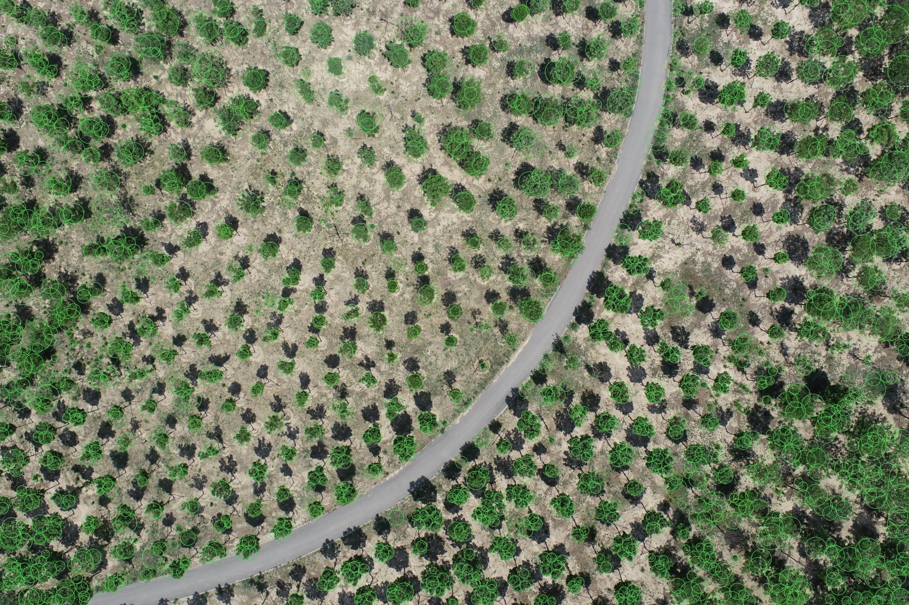
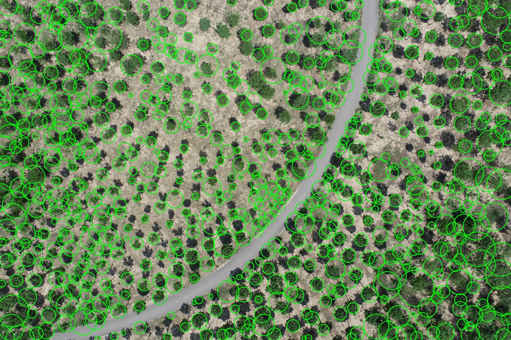
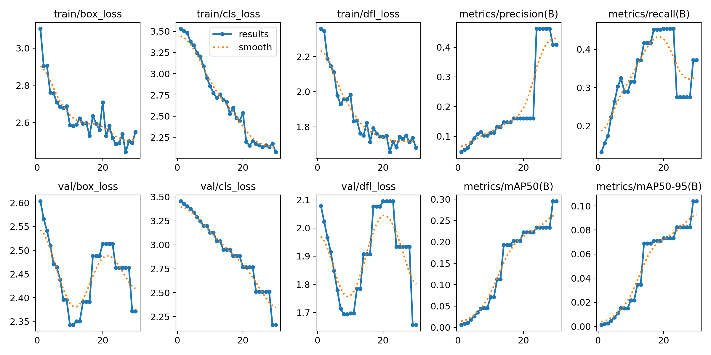
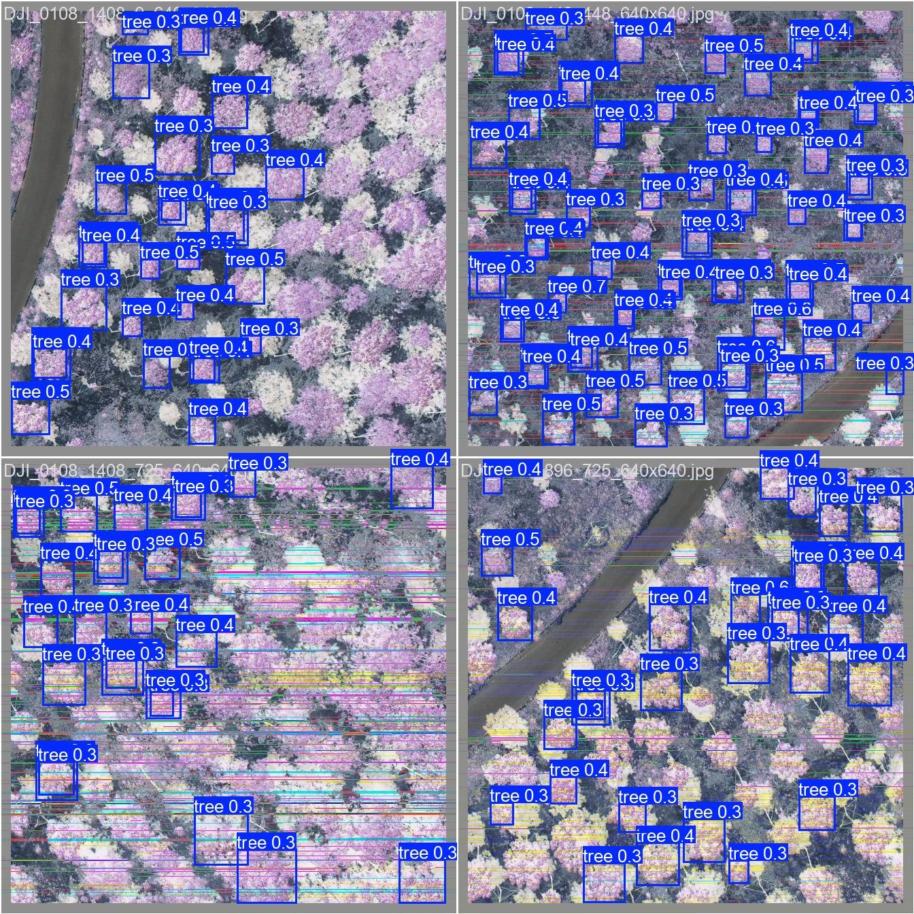

# 结果截图与说明

本页整理当前项目中已经生成的关键结果，方便提交审核、写项目说明或上传到 GitHub。

## 1. 多策略树冠检测

说明：

- 输入：无人机俯拍图 `DJI_0108.JPG`。
- 输出：树冠自动圈画结果。
- 方法：HSV、ExG、Lab、距离变换、分水岭、多策略候选融合和去重。
- 示例结果：增强检测流程在 `DJI_0108` 上输出 1272 个树冠候选。

## 2. GPT-4o Vision 二次验证

说明：

- 输入：OpenCV 候选树冠裁切网格。
- 输出：通过大模型复核后的树冠列表。
- 能力：过滤草斑、阴影、裸地等误检，并输出树种、置信度和判断原因。
- 示例结果：`output_test_opencv/DJI_0108_trees.xlsx` 包含 659 条验证后记录。

## 3. YOLOv8 本地训练曲线

说明：

- 输入：由人工修正或伪标签转换出的 YOLO 数据集。
- 输出：本地训练后的 `best.pt`、训练曲线、验证预测图和评估指标。
- 当前仓库包含 207 张 YOLO 切片图像和 207 个标签文件，可用于演示从 AI 预标注到本地模型训练的闭环。

## 4. YOLO 验证集预测

说明：

- 展示 YOLO 模型在验证切片上的预测效果。
- 适合证明项目不只是一次性调用视觉模型，而是把 AI 标注结果继续沉淀为可训练数据。

## 可用于申请表的简短描述

我构建了一个无人机航拍树冠智能识别系统，可以自动完成树冠候选检测、GPT-4o Vision 二次验证、误检过滤、漏检补充、树种/置信度标注、Excel 导出、本地 YOLO 训练和 Web 可视化展示。项目已处理 66 张航拍图，沉淀了 128 个标注结果表和 207 组 YOLO 训练切片。由于单张高分辨率航拍图通常包含数百到上千个候选树冠，每轮都需要大量图像 tile、视觉推理、JSON 结构化输出和多轮修正，因此需要较高的 token 与图像额度支持后续批量处理和模型迭代。
